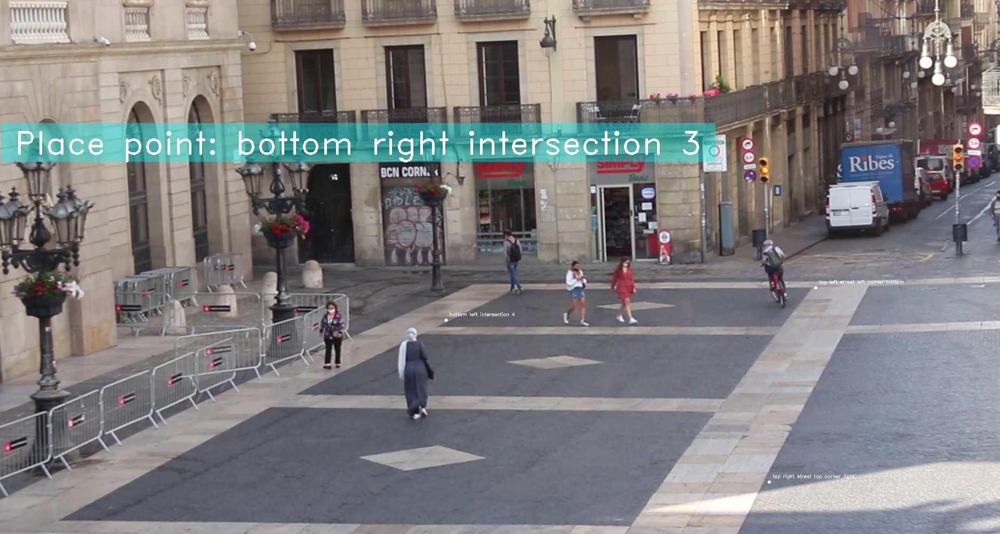
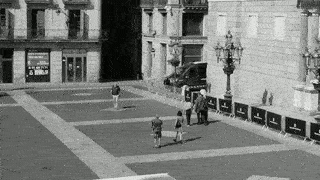

# Video to Geospatial with Yolov5 + Deep Sort

## Introduction

This tool tracks people on a video and convert them to a geospatial references.

This repository is based https://github.com/mikel-brostrom/Yolov5_DeepSort_Pytorch and contains a moded version of PyTorch YOLOv5 (https://github.com/ultralytics/yolov5). It filters out every detection that is not a person. The detections of persons are then passed to a Deep Sort algorithm (https://github.com/ZQPei/deep_sort_pytorch) which tracks the persons.
*The reason behind the fact that it just tracks persons is that the deep association metric is trained on a person ONLY datatset.*

It was developed as part of the Master in City and Technology - IAAC by:
- Adriana Aguirre Such
- Diana Roussi
- Dongxuan Zhu
- Hebah Qatanany
- Tugdual Sarazin

## Requirements

Python 3.8 or later with all requirements.txt dependencies installed, including torch>=1.7. To install run:

`pip install -U -r requirements.txt`

All dependencies are included in the associated docker images. Docker requirements are: 
- `nvidia-docker`
- Nvidia Driver Version >= 440.44

## Before you run the tracker

1. Clone the repository recursively:

`git clone --recurse-submodules https://github.com/mikel-brostrom/Yolov5_DeepSort_Pytorch.git`

If you already cloned and forgot to use `--recurse-submodules` you can run `git submodule update --init`

2. Github block pushes of files larger than 100 MB (https://help.github.com/en/github/managing-large-files/conditions-for-large-files). Hence you need to download two different weights: the ones for yolo and the ones for deep sort

- download the yolov5 weight from the latest realease https://github.com/ultralytics/yolov5/releases. Place the downlaoded `.pt` file under `yolov5/weights/`
- download the deep sort weights from https://drive.google.com/drive/folders/1xhG0kRH1EX5B9_Iz8gQJb7UNnn_riXi6. Place ckpt.t7 file under`deep_sort/deep/checkpoint/`

## Configuration

Configure the different files 

The configuration is saved on the `config.py` file:

````python
class Config:
    # Path of the video source file
    video_path = 'data/bcn_jaume/jaume_5_10am.MOV'
    # Path of the tracking video 
    video_save_path = 'data/bcn_jaume/jaume_5_10am_tracking.MOV'
    # Path of the reference points
    refpoints_geojson_path = 'data/bcn_jaume/jaume_5_10am_refpoints.geojson'
    # Path of the transposition matrices
    converter_path = 'data/bcn_jaume/jaume_5_10am_converter'
    # Path where video geospatial tracking is saved   
    history_geojson_path = 'data/bcn_jaume/jaume_5_10am_geohistory.geojson'
    # The frame frequency when the tracking is done
    frame_rate = 10
    # Yolo detection threshold 
    yolo_thres = 0.10
````

## Initialize the geospatial transposition

**Configuration required for this:**
- Config.refpoints_geojson_path
- Config.video_path



This step configures the transposition (video to geospatial) parameters file.
It is done with the `configure_geo.py` program.
It requires 4 geospatial points file (`Config.refpoints_geojson_path`), this file must contain 4 geospatial points (EPSG:4326).
The user interface of the `configure_geo.py` helps you to set the position of these 4 points on the video (`Config.video_path`).
It will save the transposition parameters in the file `Config.converter_path`.

**Run it :**
```bash
python configure_geo.py
```

## Tracking



The tracking program identifies people on the video (`Config.video_path`), follows them and assigns them an **id**.
The program save the analysis video in the `Config.video_save_path` file . 
The position of people is convert to the geospatial (epsg:4326) and save in the file `Config.history_geojson_path`.

**Run it :**
```bash
python track.py
```

## Other information

For more detailed information about the algorithms and their corresponding lisences used in this project access their official github implementations.

